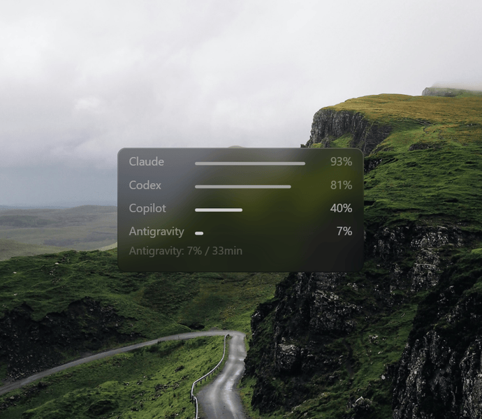
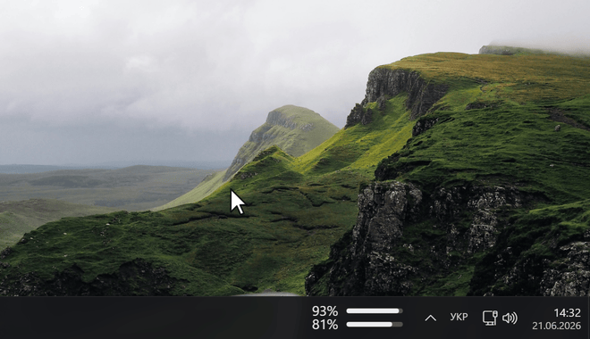
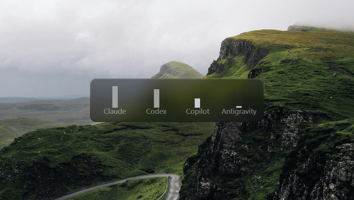
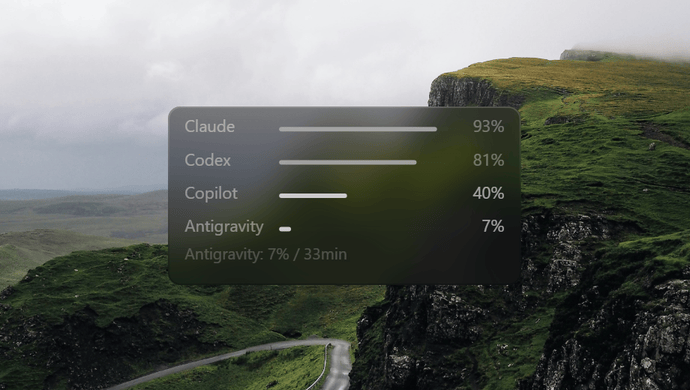
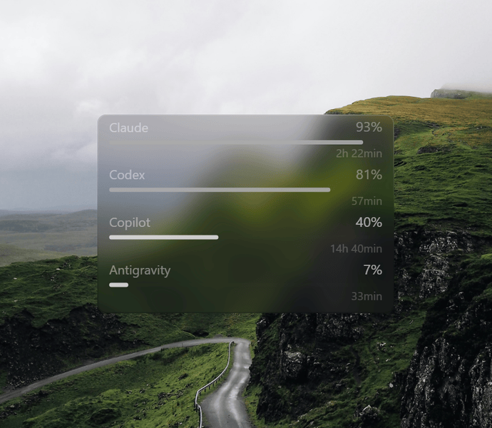
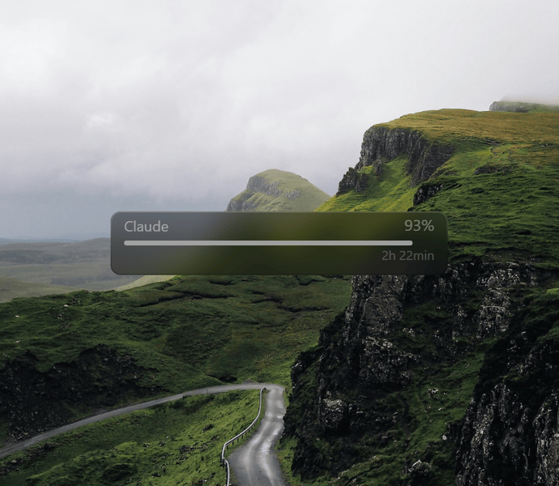
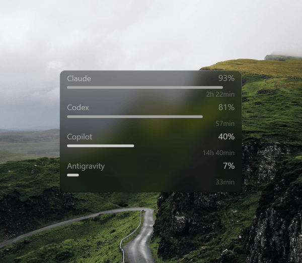
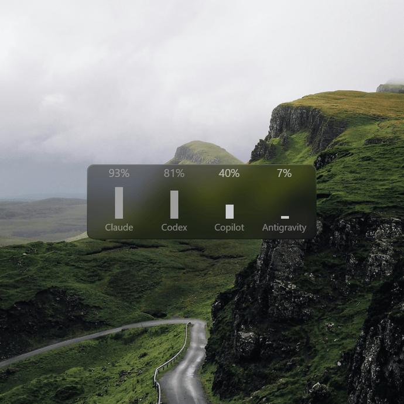

# AI Limits

A tiny native Windows 11 floating overlay that shows your AI provider usage
limits right on the desktop: **Claude**, **OpenAI Codex**, **GitHub Copilot**,
**Google Antigravity**.

🇺🇦 [Українська версія / Ukrainian version](README.uk.md) ·
[Website](https://napxlexn.github.io/ailimits/)

<p align="center">
  
  <br><sub>Three detail levels: Compact, Medium, Expanded. Switching is live; the optional burn-rate forecast (~time to limit) appears on the meta line. Horizontal bars here.</sub>
</p>

<p align="center">
  
  <br><sub>With the widget hidden, usage stays on the taskbar. The tray icon shows the two busiest providers as two rings. Hovering either gives the full list. Both follow the system light and dark theme.</sub>
</p>

<table>
<tr>
<td width="50%" align="center" valign="top">
  
  <br><sub>The same three levels with vertical bars.</sub>
</td>
<td width="50%" align="center" valign="top">
  
  <br><sub>Three width steps. At the narrowest, provider names are dropped and the bar takes their column, so nothing overlaps.</sub>
</td>
</tr>
<tr>
<td width="50%" align="center" valign="top">
  
  <br><sub>Background opacity, from near-clear to near-solid. Text and bar contrast stay put.</sub>
</td>
<td width="50%" align="center" valign="top">
  
  <br><sub>The card is sized to the providers you enabled, one to four.</sub>
</td>
</tr>
<tr>
<td width="50%" align="center" valign="top">
  
  <br><sub>Monochrome plus eight colour palettes, with brightness, saturation and background opacity. Rendered by the app itself.</sub>
</td>
<td width="50%" align="center" valign="top">
  
  <br><sub>With vertical bars, providers sit side by side or stack into a column.</sub>
</td>
</tr>
</table>

## What it does

- **Reads, never writes.** It reads the tokens the official CLI tools already
  store on your machine. It never refreshes or rotates them, so it cannot log
  you out of those tools. Keys you add yourself are stored in Windows
  Credential Manager. The app connects only to the providers' own endpoints
  and sends no telemetry.
- **No setup.** Your normal CLI use keeps the tokens valid, so there is
  nothing to log into and nothing to configure.
- **Low load, measured on the running app.** 0.024% of one CPU core, no GPU
  use (it renders on the CPU), about 60 MB RAM, no raised timer resolution,
  a 3 MB exe. Reproduce it with `bench/perf_audit.ps1`; the full numbers are
  in [docs/en/ARCHITECTURE.md](docs/en/ARCHITECTURE.md#resource-footprint-measured-not-estimated).
- **Stale data is marked as stale.** A value that stops updating greys out and
  shows its age. A limit window that has provably reset shows `≈0%`. The app
  does not fill gaps with guesses.
- **Self-contained.** Statically linked, so no Visual C++ Redistributable and
  no bundled DLLs. The installer needs no admin rights.

## Install

From the terminal:

```powershell
# winget
winget install napxlexn.AILimits

# one-line install: downloads the latest release, verifies its SHA-256
# against the published digest, runs the silent per-user install
irm https://raw.githubusercontent.com/napxlexn/ailimits/master/install.ps1 | iex

# Scoop, from the project's own bucket
scoop bucket add ailimits https://github.com/napxlexn/scoop-ailimits
scoop install ailimits
```

Or download `AiLimits-Setup-<version>.exe` from
[Releases](https://github.com/napxlexn/ailimits/releases) and run it.
No admin rights needed (installs to `%LOCALAPPDATA%\AiLimits`).
Optional during setup: autostart with Windows, a desktop shortcut.
A portable zip (no installer) is attached to each release as well. A portable
copy does not self-update: its package manager, or you, updates it.

> The installer is **not code-signed**, so Windows SmartScreen may show
> "Windows protected your PC". Click **More info → Run anyway**. You can
> verify the download against the SHA-256 published on each release.

The installer contains no keys or tokens. On first launch the widget looks for
the auth sources listed below.

## Quick start

1. **Run it.** On first launch it finds the CLIs you already use (Claude Code,
   Codex, `gh`, Antigravity CLI, and still-supported Gemini CLI sessions) and
   starts showing usage. Nothing to log into, nothing to configure.
2. **Place it.** Drag with the left button. Hold **Shift** while dragging to
   snap to the nearest screen edge. `Lock position` in the right-click menu
   pins it.
3. **Set the look.** Right-click for detail level (Compact, Medium, Expanded),
   bar layout (vertical or horizontal), palette, opacity, brightness and
   saturation. The animations above show each one.
4. **Hover a provider row** to swap its reset countdown for its weekly limit.
   A greyed or `≈` row shows the reason and the fix instead, for example
   `token expired, run Claude Code`.
5. **Playing something fullscreen?** Right-click, **Indicator**, then *Panel*
   or *Tray*. Usage stays on the taskbar while the overlay is hidden or
   covered. See [Taskbar indicator](#taskbar-indicator).
6. **Left-click the tray icon or the panel** to raise the widget or hide it.
   Right-click either one for the same menu.

## How authorization works

The widget never asks you to log in. It monitors **subscription** limits by
reusing the tokens the official CLI tools keep on your machine, strictly
read-only:

| Provider | Automatic source (default) | To enable it |
|---|---|---|
| Claude | `%USERPROFILE%\.claude\.credentials.json` (Claude Code OAuth token) | run [Claude Code](https://claude.com/claude-code) at least once |
| Codex | `%USERPROFILE%\.codex\auth.json` (Codex CLI token) | run `codex login` once |
| Copilot | `gh auth token` (GitHub CLI) | `gh auth login` once |
| Antigravity | Windows Credential Manager target `gemini:antigravity`; fallback `%USERPROFILE%\.gemini\oauth_creds.json` | run Antigravity CLI once, or use a still-supported Gemini CLI flow |

These are short-lived OAuth access tokens. The CLI that owns each one
refreshes it whenever you use that CLI. The widget never refreshes a token
itself, because an OAuth refresh rotates it and would log the CLI out.

### How long it stays accurate without any action

| Provider | Live data lasts | After that |
|---|---|---|
| **Claude** | ~8 hours after your last Claude Code session (the token's real lifetime) | falls back to `statusline.jsonl`, else shows the last value greyed |
| **Codex** | while you actively use Codex CLI (its token is shorter-lived) | the last value greyed, with its age |
| **Copilot** | Indefinitely. gh keeps its token fresh while you stay logged in. | |
| **Antigravity** | while Antigravity CLI refreshes its keyring token, or a supported Gemini CLI flow refreshes `oauth_creds.json` | the last value greyed, with its age |

Google stopped serving Gemini CLI requests for individual, Google AI Pro, and
Google AI Ultra users on June 18, 2026. Those users are expected to migrate to
Antigravity CLI; the widget reads Antigravity's Windows Credential Manager
token before trying the legacy Gemini CLI file.

**Claude has a server-side limit on how often it can be read.** Anthropic
rate-limits the usage endpoint (HTTP 429, `Retry-After: 0`, verified
2026-07-09), and the per-token budget is shared with Claude Code's own
polling. While Claude Code is running, a Claude refresh can take 2 to 3
minutes even on the 1-minute interval. The rejected cycle retries a minute
later. Other providers are unaffected.

An expired Claude or Codex token does not produce wrong numbers. The last
value stays greyed with its age, a window that has provably reset shows `≈0%`,
and the reset countdown keeps running locally. If you use the CLIs daily, the
data is live nearly all the time.

### Manual authorization (for independence or no-CLI setups)

For setups without the CLIs, or when you want a credential that does not
depend on CLI activity. What each option actually gives you:

| Provider | Manual option | Where to get it | Shows the same as the subscription? |
|---|---|---|---|
| **Copilot** | Personal Access Token, can be set to never expire | github.com/settings/tokens, *Generate new token* | Yes. This is the set-and-forget option. |
| **Claude** | API key | console.anthropic.com, Settings, API Keys, *Create Key* (`sk-ant-…`) | No. It shows your API account rate limits, not your Pro or Max subscription usage. |
| **Codex** | None | No separate stable token exists. The usage token is the same short-lived OAuth token. | |
| **Antigravity** | None | The quota is tied to the OAuth token that Antigravity CLI refreshes, and no separate key reports the same numbers. | |

**Two ways to add a credential:**

1. **From the clipboard.** Copy the key or token, then right-click the widget,
   **Providers**, the provider, and the matching `Paste … from clipboard`
   item. Copilot takes a PAT; Claude takes an API key (which switches the
   method) or a usage token, which is tried before the auto-detected one;
   Codex takes a usage token. A toast confirms, and the secret goes straight
   into Credential Manager.
2. **From the terminal.** `ailimits-auth.exe` sits next to the widget in
   `%LOCALAPPDATA%\AiLimits`:
   ```
   ailimits-auth status                       # show every detected source
   ailimits-auth set copilot                  # store a PAT (hidden input)
   ailimits-auth set claude                   # store a Claude API key
   ailimits-auth set-usage-token claude|codex # store a manual usage token
   ailimits-auth remove copilot|claude
   ailimits-auth remove-usage-token claude|codex
   ```
   `set-usage-token` sends one request to the provider's usage endpoint first
   and stores the token only if it is accepted.

**To go back to automatic:** remove the key with `Remove key` in the menu or
with the CLI. The provider returns to its subscription sources.

## The context menu

Right-click the widget: detail level (Compact / Medium / Expanded), layout
(Vertical / Horizontal), Width (100 / 75 / 50%, horizontal bars only),
Arrangement (in a row / in a column, vertical bars only), `Lock position` and
`Always on top` (two independent toggles), Palette (monochrome + 8 colors), Background opacity, Brightness,
Saturation, Forecast (burn-rate "~time to limit", off by default), Update
interval (1 / 5 / 15 / 30 min), `Automatic updates` (silent background
self-update, on by default), Indicator, per-provider settings, Quit.

### Taskbar indicator

Even with the overlay hidden or covered by a fullscreen app, a compact usage
readout stays visible. Right-click → **Indicator**:

- **Tray icon.** One 16px icon: two concentric rings, the busiest provider
  outside and the runner-up inside, both filling clockwise from 12 o'clock.
  Monochrome, drawn in the system taskbar theme.
- **Panel.** A transparent overlay next to the clock. There is no window or
  box, only clock-sized digits and bars drawn over the taskbar. It is
  monochrome, follows the system light and dark theme, shows the first two
  providers in the widget's order, and tracks the taskbar as it moves
  (auto-hide, resolution changes, tray width). Hover it for a tooltip with
  every provider. If Start, Search or the auto-hide bar covers it, it hands
  over to the tray rings and comes back on its own. If a fullscreen app takes
  the screen, it hides with the taskbar and returns when you alt-tab out.
- **Off.** No indicator.

If Windows shows the taskbar on more than one display, **Indicator → Display**
picks which taskbar the panel attaches to. The submenu only appears when a
second taskbar exists; if the chosen display is later disconnected, the panel
falls back to the primary taskbar.

Left-clicking the tray icon or the panel brings the widget to the front (or
hides it if it is already there, on top); right-clicking **anywhere on the
panel** opens this same menu.

## Config & diagnostics

`%APPDATA%\AiLimits\config.toml` is created automatically, and every menu change
is persisted there. Format reference: [docs/en/CONFIG.md](docs/en/CONFIG.md).

Set `AILIMITS_LOG=ailimits=debug` or `RUST_LOG=ailimits=debug` to write a
diagnostic log to `%APPDATA%\AiLimits\ailimits.log` (stderr is invisible in a
GUI app).

## Build from source

```
# Rust 1.86+, Windows 11
cargo build --profile release-min     # ~3 MB exe in target/release-min/
cargo test
```

Developer docs: [docs/en/](docs/en/) (English),
[docs/uk/](docs/uk/) (Ukrainian).

## License

Copyright (C) 2026 napxlexn.

AI Limits is free software licensed under the
[GNU General Public License, version 3 or later](LICENSE). You may use,
study, modify, and redistribute it. If you distribute a modified version,
you must provide its corresponding source code under the same license,
preserve the copyright and license notices, and clearly mark your changes.

The GPL license for the software does not grant rights to present modified
builds as official AI Limits releases. See [TRADEMARKS.md](TRADEMARKS.md)
for the rules governing the project name and logo. Third-party components
remain subject to their respective licenses.
